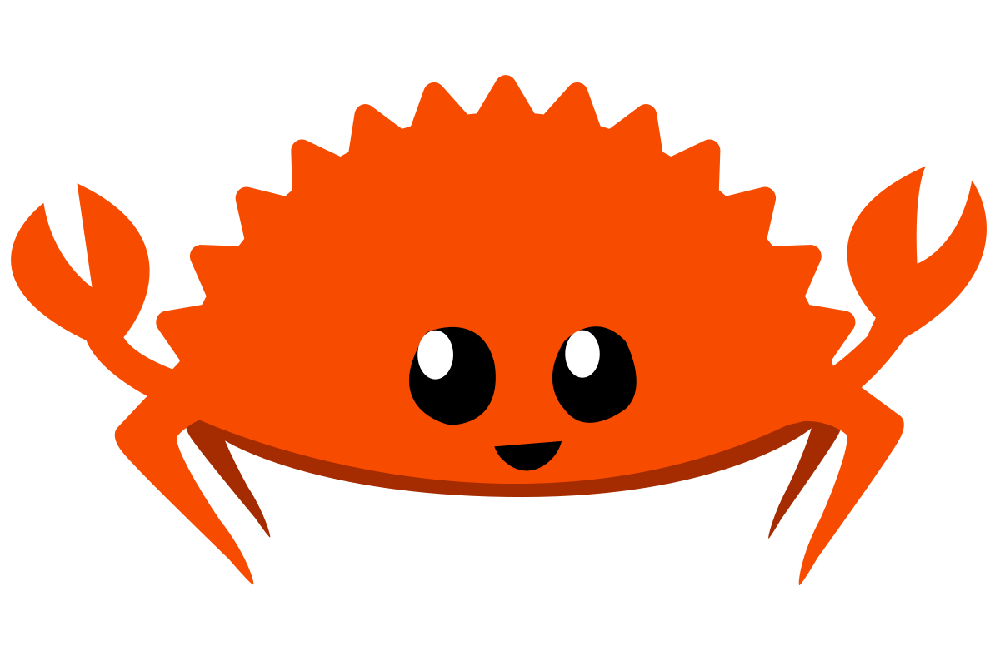

+++
title = "rust belt rust conference"
description = "i'm happy to announce that i'll be giving a workshop at rust belt rust conf 2019!"
date=2019-08-10

insert_anchor_links = "right"

[taxonomies]
tags = ["rust", "conferences"]
categories = ["updates"]

[extra]
+++

# tl;dr - i'm teaching a workshop

i didn't expect to write again so soon, but it never hurts. long story short, i
am very ${HAPPY|NERVOUS} to announce that i am giving a full-day workshop at
the rust belt rust conference this year. without risking further spoilers, i
refer you to the [ website](https://www.rust-belt-rust.com/sessions/#lisp), but
for those interested, whether attendees or otherwise, keep a close eye on this
blog in late october.

that all said and done, there are some tangential things i would like to talk
about wrt rust's community and this opportunity i have been given.

# background

i attended rust belt rust (RBR) for the first time last year when i was still
inexperienced with rust[^1]. i dabbled with it multiple times before and
attempted non-trivial projects, but altogether nothing that amounted to
something and, consequentially, no real in-depth knowledge of rust. despite
that, there was no hesitation on the part of the RBR organizers and sponsors,
especially Carol ${Nicholls|Goulding}. i really didn't have any money at the
time, but they managed to cover all costs for my attendance and i'm still very
thankful for that.

it was at RBR that i attended a workshop taught by [Matthias
Endler](https://matthias-endler.de/) and [Santiago
Pastorino](https://santiagopastorino.com/) that revolved around building a [toy
shell](http://conf2018.rust-belt-rust.com/sessions/#shell) in rust. this
workshop was a great experience for me (afaik, everyone) because of the
applicability and the and engaging with the material. now, by definition,
technical workshops are supposed to be engaging and applied, but this workshop
was doubly so for someone inexperienced and looking for a fun, ready, and
"realistic" application of rust.

fast-forward to the end of the conference, and i am talking with Endler and
Pastorino about how much i enjoyed the workshop and how prior to it i kept
failing to find a reason to "really learn" rust. after mentioning how i needed
that next "thing" to keep myself motivated and learning rust outside of school,
Endler challenged me to teach the same workshop next year. 

**tbqh, i laughed.** Endler asked "why not?  you'll have 12 months to prepare."
i thought it was ridiculous but less than 12 hours later - on a total whim while
i waited to board my plane - i wrote an email mentioning such an idea to
Carol. she more than humored my pitch and said to consider myself invited for
RBR 2019.

between that email and may'ish, i spent a good amount of time getting better at
rust with various little projects. as of two months ago, Carol replied on that email asking if
i was still interested in giving a workshop and that her invitation was still
completely open to me.

i largely forgot the email and Endler's challenge upon receiving that reply,
but what is certain is that my experience at RBR last fall helped begin a
greater change in my career (life?) to take a greater focus on my skills as a
software engineer, particularly with rust. compared to a year ago, i felt a lot
more confident and more invested in both rust and its community; i wasn't sure
initially, but it felt like up to that point in time that friends and kind
strangers (Carol, Endler, and others) all supported and challenged me to say
yes.

**... and that's how i got the opportunity to teach my first workshop at tech
conference.** really, that's all i wanted to say. thank you so much to everyone
who made this possible, especially Carol, Endler, the broader rust community,
and those close confidants who prodded me to say yes. in the grand scheme of
things, it's not all that huge of an event, but these past two years have been
personally very tumultuous and uncertain, and it feels like i've finally
started to find my ground.

i'll see you all at rust belt rust in october!

    

---

[^1]: relatively speaking, i still consider myself inexperienced but friends and peers insist otherwise 

